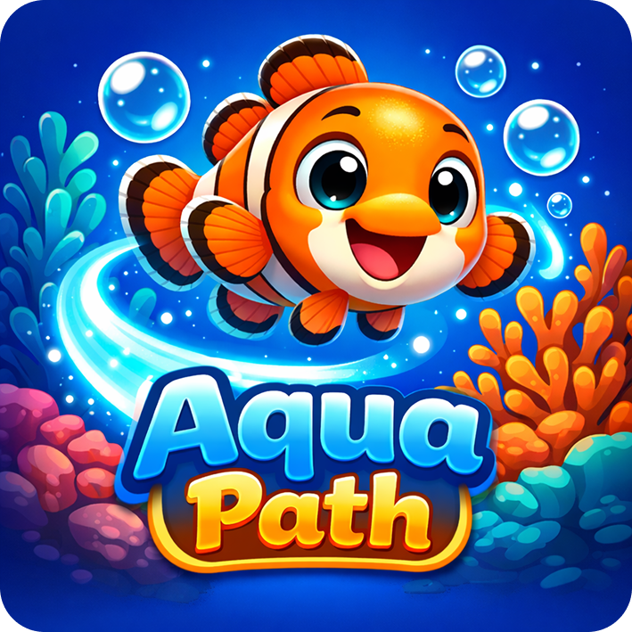

# 🐠 Aqua Path: Reef Builder

A 2D casual "grow-and-collect" runner game built with Flutter and Flame engine. Guide your fish through hazardous underwater paths, eat to evolve, avoid pollution, and rebuild a vibrant underwater ecosystem.



---

## 🎮 Game Overview

Players control a fish that automatically swims forward through an underwater obstacle course. The core mechanics include:

- **Eat & Evolve:** Collect food bubbles to grow from a small Clownfish → Teal Fish → Blue Tang
- **Avoid Hazards:** Dodge fishing nets, plastic pollution, and oil spills
- **Break Through:** Larger fish can smash through certain obstacles
- **Build Your Reef:** Rescued fish populate your sanctuary (meta progression)

---

## 🛠️ Tech Stack

- **Framework:** Flutter 3.10+
- **Game Engine:** Flame ^1.34.0
- **Audio:** flame_audio ^2.11.12
- **Typography:** google_fonts ^6.3.3
- **Persistence:** shared_preferences ^2.3.4

---

## 📁 Project Structure

```
ocean_path/
├── lib/
│   └── main.dart              # Game entry point
├── assets/
│   ├── images/                # Sprites and UI graphics
│   ├── audio/                 # Music and sound effects
│   └── fonts/                 # Fredoka & Nunito fonts
├── documentation/
│   ├── prd.md                 # Product Requirements Document
│   ├── designLanguage.md      # Visual Design System
│   ├── implementationPlan.md  # Technical Development Guide
│   └── assetReference.md      # Complete Asset Inventory
└── pubspec.yaml               # Dependencies & asset declarations
```

---

## 🚀 Getting Started

### Prerequisites
- Flutter SDK 3.10.4 or higher
- Dart SDK 3.0+

### Installation

```bash
# Clone the repository
git clone <repository-url>
cd Ocean

# Install dependencies
flutter pub get

# Run the app
flutter run
```

---

## 📖 Documentation

| Document | Description |
|----------|-------------|
| [PRD](documentation/prd.md) | Product requirements and game mechanics |
| [Design Language](documentation/designLanguage.md) | Visual style guide and UI components |
| [Implementation Plan](documentation/implementationPlan.md) | Technical development phases |
| [Asset Reference](documentation/assetReference.md) | Complete asset inventory and usage |

---

## 🎨 Design Highlights

- **Color Palette:** Deep ocean blues with coral/orange accents
- **Typography:** Fredoka (headers) + Nunito (body)
- **UI Style:** Wooden buttons + bubble effects
- **Philosophy:** "Digital Aquarium" - fluid, organic, family-friendly

---

## 📋 Development Status

### Phase 1: Core Engine ⏳
- [x] Project setup
- [x] Asset organization
- [ ] Parallax background
- [ ] Fish player controls

### Phase 2: Gameplay ⏳
- [ ] Obstacle spawning
- [ ] Collision detection
- [ ] Growth/evolution system

### Phase 3: Meta-Game ⏳
- [ ] Main menu (Reef view)
- [ ] Save/load system
- [ ] HUD overlays

### Phase 4: Polish ⏳
- [ ] Audio integration
- [ ] Particle effects
- [ ] Difficulty scaling

---

## 📄 License

[Add your license here]

---

## 🤝 Contributing

[Add contribution guidelines here]
